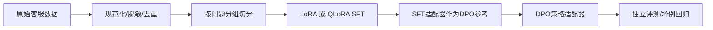

# 电商客服大模型训练与偏好对齐

Qwen3-8B 的 QLoRA SFT、DPO、同条件模型对照与证据审计项目。实现数据清洗和隔离切分、训练参数更新检查、逐例预测留痕、外部数据抽样、配对不确定性分析及真人盲评流程。

[](https://github.com/Amberspring/ecommerce-alignment/actions/workflows/cpu-checks.yml)

| 当前证据 | 结论 |
|---|---|
| 2026-10-06，RTX 4080 SUPER 32GB，SFT/DPO 各 40 step | 训练链路、policy 更新和 reference 冻结得到验证；不代表业务泛化。 |
| 48 条合成政策题：Base 31/48，SFT 48/48，DPO 48/48 | 模板数据已饱和，且 Base 有 6 条截断；不能据此宣布 DPO 优于 SFT。 |
| 历史 AmazonQA 20 题：F1 约 0.215/0.221/0.219，EM 均为 0 | 没有观察到可靠的 SFT/DPO 外部增益；样本太小。 |
| 新冻结 AmazonQA 200 题 | 数据与 manifest 已在 CPU 上生成，模型预测和真人盲评尚未运行。 |

当前本机和仓库不含 8B 适配器权重，远端原文件是否仍在尚未核实，不能仅凭日志复现相同模型。项目当前可证明后训练实验设计和负结果分析，尚不能声称真实客服质量提升；详见[独立评测与真人盲评](docs/HUMAN_EVAL.md)和[下一次模型验收预算](docs/NEXT_RUN_BUDGET.md)。

**当前交付：CPU 工程验证 + Qwen3-8B GPU 主链路实测。** QLoRA SFT 与 DPO 各训练 2 epoch/40 step；SFT 和 DPO 分别记录 9.84GB、11.69GB 的 PyTorch peak allocated memory，均有 144 个可训练张量发生变化，DPO reference 保持不变。
CPU 实验确实调用 TRL、PEFT 和 Qwen3 架构，但模型很小、随机初始化；不能把其 loss、token accuracy 或 reward accuracy 写成 8B 客服准确率。
另已把实际训练后的微型策略模型通过 HTTP 接入项目三，验证训练产物到服务的完整链路；微型模型不能用于实际客服。

## 安装与本机复现

推荐 Python 3.12。以下命令在当前仓库目录运行，python 应指向你自己的虚拟环境。

```sh
python -m venv .venv
# Windows PowerShell: .venv/Scripts/Activate.ps1
# Linux/macOS: source .venv/bin/activate
python -m pip install torch==2.7.1 --index-url https://download.pytorch.org/whl/cpu
python -m pip install -e ".[trl-smoke,eval]" pytest==8.3.5
python -m ecom.data
python -m ecom.smoke
python -m ecom.trl_smoke
python -m pytest -q
```

执行后，数据切分位于 artifacts/data/，训练产物位于 artifacts/trl-smoke/，真实运行记录位于 results/。仅测试数据清洗可安装 requirements.txt；训练验证需额外安装上述 CPU 依赖。

可选真实 CPU 推理：安装 `python -m pip install -e ".[serve]"`，运行 `python -m uvicorn ecom.cpu_api:app --host 127.0.0.1 --port 8000`。它加载 artifacts/trl-smoke/merged 的实际训练产物，只验证本地英语小词表与接口；例如 refund 返回简短教学输出。zip 不包含 artifacts，解压后先运行 trl_smoke 重建。

## 实现与设计



- 去除空样本、超长样本和重复问题；相同问题即使回答不同也只能进入一个分区。
- 正则遮盖手机号和邮箱。它不是完整的个人信息识别器；真实数据仍需要人工审核。
- 偏好训练数据只使用 SFT 训练分区的问题，避免把测试问题泄漏进 DPO。
- SFT 显式使用 Qwen 非思考模板，仅 completion 部分计算 loss。
- DPO 加载 SFT 的 policy/reference 两份适配器，参考适配器不参与更新。
- LoRA rank=4/8/16/64、q/v 与全线性层、NF4 QLoRA 配置已提供；DPO beta=0.05/0.1/0.3 共用同一 SFT 起点；没有预先填入胜负结论。
- 评测检查预测 ID 完整性，提供关键词规则得分与坏例分类。规则通过率不等于人工偏好胜率。

## GPU 实验与复现

在 Linux NVIDIA CUDA 环境另建虚拟环境，安装适合显卡的 PyTorch 后执行：

```sh
python -m pip install -e ".[gpu,eval]" pytest
python -m ecom.data
python scripts/ablation.py
# 加 --execute 才真正执行全部 SFT 配置。
python -m ecom.train --config configs/lora-r16-qv.json --stage sft
python -m ecom.train --config configs/lora-r16-qv.json --stage dpo
python scripts/merge_adapter.py --adapter artifacts/lora-r16-qv/dpo/policy --output artifacts/merged-model
```

完整 8B 模型是否能训练取决于显存、长度、优化器及精度，不能仅凭“8B”保证某张卡够用。QLoRA 依赖 bitsandbytes；它不等于部署用的 AWQ/GPTQ。
保存 DPO 时 named adapter 位于 policy/ 子目录；部署时合并该策略适配器，不要合并 reference/。

通过项目三启动真实模型服务后：

```sh
python scripts/predict.py --output artifacts/predictions.jsonl
python -m ecom.evaluate --predictions artifacts/predictions.jsonl --output results/model-evaluation.json
```

真实消融必须保持数据切分、seed、训练步数和评测问题一致。需要另外建立独立人工偏好评测集，并记录评审标准；不能把训练集的 DPO reward accuracy 当成偏好胜率。

## 仓库内容与证据

- src/ecom/：清洗、训练、梯度 smoke、真实 TRL 集成及评测。
- configs/：四组训练配置；scripts/：消融、合并适配器、预测收集。
- data/：虚构客服政策与偏好样例；tests/：隔离切分、无泄漏、评测及梯度数值检查。
- results/：本机实测 JSON、测试报告、环境记录；experiments/：未运行实验模板。
- docs/EXPERIMENTS.md：实际结果和限制；docs/BADCASES.md：已遇到的问题及修复。

上传方式见 [docs/GITHUB.md](docs/GITHUB.md)，接口依据见 [docs/SOURCES.md](docs/SOURCES.md)。

当前原帖实验数据入口：`python scripts/build_synthetic.py`，按店铺划分 160/48/48。不要在此后运行默认 `ecom.data` 覆盖新训练集。数据为自行编写的模板化合成样例。

## 2026-10-08 真实模型验收

复用 2026-10-06 的 Qwen3-8B SFT/DPO 适配器，统一 FP16、temperature=0、非 thinking 和生成预算，48 条合成政策留出题的规则通过率为 Base 31/48、SFT 48/48、DPO 48/48。原始生成、结束原因与汇总位于 `results/policy-20261008/`；这不是实际客户满意度，也未证明 DPO 额外收益。

另用 AmazonQA 官方验证文件固定前 1 MiB 中前 20 个不同问题，向模型提供评论证据而不提供人类答案；Base/SFT/DPO 的英文 token F1 分别为 0.214826、0.220605、0.218768，exact match 均为 0。来源、范围、数据哈希与指标见 `results/amazonqa-20261008/`，复现使用 `scripts/prepare_amazonqa_legacy20.py`。该小型顺序子集非代表性抽样，F1 仅衡量词面重合，公开数据也可能出现在预训练中；新的 200 题冻结集由 `scripts/prepare_amazonqa.py` 生成，尚无模型成绩。

相同 256-token 预算下，Base 有 6 条截断，SFT/DPO 均无截断，截断计为不通过；平均输出长度分别为 134.75、13.75、13.58 token。政策规则成绩同时反映简洁输出与规则匹配，不能全部归因于事实能力差异，统计见 `results/policy-20261008/generation-audit.json`。
